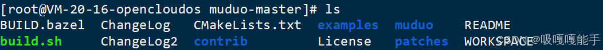

> 本文由 [简悦 SimpRead](http://ksria.com/simpread/) 转码， 原文地址 [blog.csdn.net](https://blog.csdn.net/qq_55882840/article/details/145346115)

[Muduo](https://so.csdn.net/so/search?q=Muduo&spm=1001.2101.3001.7020) 是一个基于反应堆模式的多线程 C++ 网络库。

官网：[GitHub - chenshuo/muduo: Event-driven network library for multi-threaded Linux server in C++11](http://github.com/chenshuo/muduo "GitHub - chenshuo/muduo: Event-driven network library for multi-threaded Linux server in C++11")

#### 1. 版本要求：

*   Linux 内核版本 >= 2.6.28。
*   GCC >= 4.7 或 Clang >= 3.5
*   Boost（仅用于 boost::any）。
*   Debian 7 及以上版本
*   Ubuntu 14.04 及以上版本
*   CentOS 7 及以上版本

#### 2. 安装所需软件包（必须）

*   **Debian、Ubuntu 等系统**：

```
sudo apt install g++ cmake make libboost-dev

```

*   **CentOS 系统**：

```
sudo yum install gcc-c++ cmake make boost-devel

```

#### 3. 下载 muduo-masyer.zip

        打开 muduo 官网，下载 zip 源码，并将下载好的 zip 文件上传到 linux 服务器，可以随便找个位置放着，作者放在如图所示位置


#### 4. 解压 muduo-masyer.zip

使用一下指令解压

```
unzip muduo-master.zip

```

生成 muduo-master 文件夹


cd muduo-master 



要进行构建，请运行：

```
./build.sh

```

等待构建完成  


 编译完成后，在输入./build.sh install 命令进行 muduo 库安装

```
./build.sh install

```


结束后会生程 build 目录

这个./build.sh install 实际上把 muduo 的头文件和 lib 库文件放到了 muduo-master **同级目录下**的 build 目录下的 release-install-cpp11 文件夹下面了，进入 build 目录，


 进入 release-install-cpp11/


所以上面的 install 命令并没有把它们拷贝到系统路径下，导致我们每次编译程序都需要指定 muduo 库的头文件和库文件路径，很麻烦，所以我们选择直接把 inlcude（头文件）和 lib（库文件）目录下的文件拷贝到系统目录下： 

```
cd include/

```

```
mv muduo/ /usr/include/

```

回到上级目录 

```
cd ..

```

```
cd lib/

```

```
mv * /usr/local/lib/

```

拷贝完成以后使用 muduo 库编写 C++ 网络程序，不用在指定头文件和 lib 库文件路径信息了，因为 g++ 会自动从 / usr/include 和 / usr/local/lib 路径下寻找所需要的文件。

#### 5. **测试 muduo 是否能够正常使用**

```
#include <muduo/net/TcpServer.h>
#include <muduo/base/Logging.h>
#include <boost/bind.hpp>
#include <muduo/net/EventLoop.h>
```

若以上头文件能正常加载，则说明 muduo 库安装成功