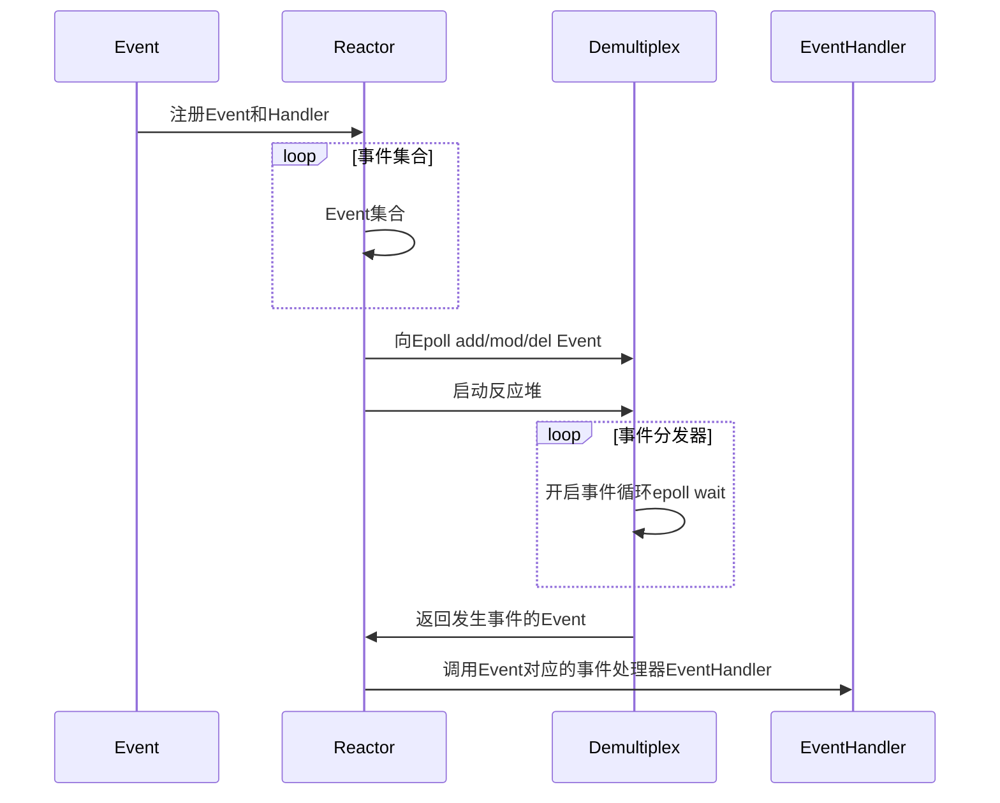

留档




图中每个subReactor都是一个EventLoop


    新连接到来，有的会被分配到mainLoop,有的分配到subLoop
    分发线程是main线程，如果正好分配轮询到本线程（acceptor所在线程），则可以直接执行，如果轮询到其他线程，则需要唤醒其线程

    始终记住，线程的数据是共享的


## 宏的高级用法

``` cpp
// LOGINFO("%s %d", arg1, arg2)
#define LOG_INFO(logmsgFormat, ...) \
    do \
    { \
        Logger& logger = Logger::instance(); \
        logger.setLogLevel(INFO); \
        char buf[1024] = {0}; \
        snprintf(buf, sizeof(buf), logmsgFormat, ##__VA_ARGS__); \
        logger.log(buf); \
    } while(0)
```

- 定义一个宏 `LOG_INFO`，用于记录 **INFO 级别** 的日志。
- 格式化日志消息并调用 `Logger` 类的 `log()` 方法输出。

#### `do { ... } while(0)`

``` cpp
do \
{ \
    // ... \
} while(0)
```

- 确保宏在语法上像一个 **独立语句**，避免在使用时因分号或作用域问题导致编译错误。

- 例如：

  ``` cpp
  if (condition)
      LOG_INFO("Hello");  // 如果没有 do-while(0)，可能会解析错误
  else
      ...
  ```

  如果没有 `do-while(0)`，`else` 可能会匹配到宏内部的 `if`（如果宏内部有 `if`），导致编译错误。

#### `##__VA_ARGS__`

- 用于处理可变参数`(...)`。
- 如果 LOG_INFO 后面没有参数（如 `LOG_INFO("Hello")`），`##`会去掉多余的逗号，避免编译错误：

#### 反斜杠 `\`

在 C/C++ 宏定义中，**反斜杠 `\`（续行符）** 的作用是 **让宏定义跨越多行**，使其在语法上看起来像一行代码。

## TcpServer


